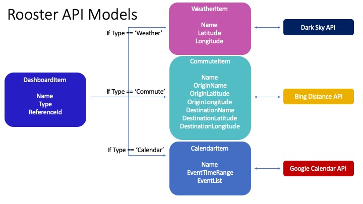

## The Daily Rooster

A daily dashboard SPA that can be configured to show weather, commute time, and Google Calendar information.

Built with an ASP .NET Core (2.2.301) + MongoDB (4.0.10) Backend, and Angular 8 Frontend

### Models

This application primarily uses the following models for both the backend and frontend:

#### DashboardItem

The primary model that references other models based on its 'DashboardItemType' property. 

#### WeatherItem

Model used to acquire weather information via Dark Sky API based on a 'Latitude' and 'Longitude' property.

#### CommuteItem

Uses the Bing Distance API and 'OriginLatitude', 'OriginLongitude', 'DestinationLatitude' and 'DestinationLongitude' properties to calculate time and distance information.

#### CalendarItem

Uses the Google Calendar API to find calendar events for a given time range, 'EventTimeRange'. Populates the 'EventList' property with these events, which is a list comprised of the 'RoosterEvent' class which captures the calendar event summary, location, and start/end times.

### Frontend 

The Angular frontend straightforward features to view, add, edit, and delete various 'dashboard items'.

#### Detail

#### Edit

#### Create

#### Delete

### Backend 

The backend consists of a controller for each aforementioned model, including a 'CalendarController', 'CommuteController', 'DashboardController', and 'WeatherController'.

